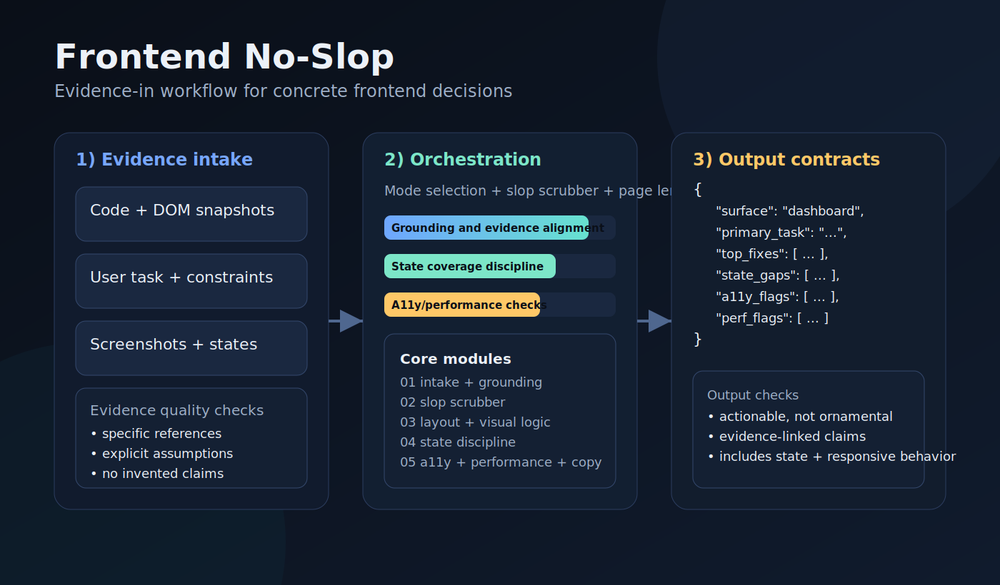
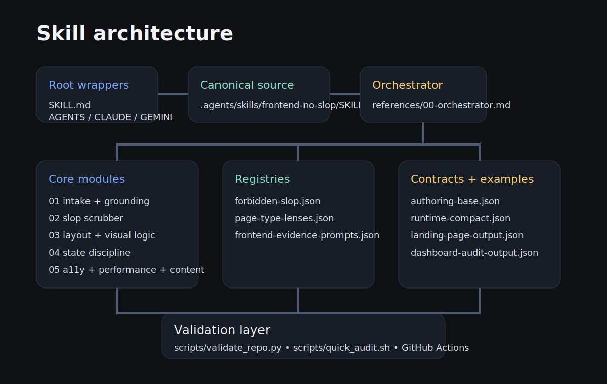

# Frontend No-Slop

[](LICENSE)
[](https://github.com/Emily2040/frontend-no-slop/actions/workflows/validate.yml)
[](AUDIT_REPORT.md)
[](.agents/skills/frontend-no-slop/SKILL.md)

Grounded frontend design and implementation guidance for agents that keeps UI work concrete, accessible, and production-aware instead of drifting into generic design filler.



## Quick start

```bash
git clone https://github.com/Emily2040/frontend-no-slop.git
cd frontend-no-slop
cp AGENTS.md /path/to/project/
cp -R .agents /path/to/project/
python scripts/validate_repo.py
```

## What this is for

Use this skill when an agent needs to:

- design or critique a landing page, dashboard, docs surface, settings page, form, table, modal, or component
- plan frontend implementation in React, Vue, Svelte, HTML/CSS, or stack-agnostic terms
- define design-system primitives, states, variants, and responsive behavior
- rewrite UI copy so it becomes literal and useful instead of mushy marketing vapor
- audit a screen before deployment with structural and packaging checks

## Non-goals (when not to use this skill)

Avoid this skill for:

- backend API design, data modeling, and infrastructure architecture
- database performance tuning and query optimization
- brand strategy or creative direction with no interface artifact
- legal/compliance interpretation that needs specialist review

## What it actively blocks

This skill is opinionated against:

- aesthetic claims with no interface detail
- invented proof, fake metrics, and placeholder theater
- trend cargo-culting such as giant empty heroes, glass blur for no reason, or neon dashboards with no task logic
- component specs with missing states
- accessibility and performance hand-waving
- frontend advice that sounds nice but cannot be implemented

## Architecture



The package follows progressive disclosure and a canonical-source wrapper layout:

1. Root `SKILL.md` is a router under the recommended size limit.
2. `.agents/skills/frontend-no-slop/SKILL.md` is the canonical source.
3. `references/00-orchestrator.md` loads the right core modules only when needed.
4. Registries store anti-slop rules and page-type lenses.
5. JSON schemas define machine-readable output contracts.
6. Validation scripts and CI keep the package honest.

## Repository map

```text
.
├── .agents/skills/frontend-no-slop/
│   ├── SKILL.md
│   ├── references/00-orchestrator.md
│   ├── skills/core/
│   ├── registry/
│   ├── schemas/
│   └── examples/
├── SKILL.md
├── AGENTS.md
├── CLAUDE.md
├── GEMINI.md
├── .cursorrules
├── .clinerules
├── README.md
├── LICENSE
├── .gitignore
├── AUDIT_REPORT.md
├── CHANGELOG.md
├── docs/
├── templates/
├── scripts/
└── .github/workflows/validate.yml
```

## Installation

### Generic AGENTS-style loaders

```bash
git clone https://github.com/Emily2040/frontend-no-slop.git
cd frontend-no-slop
cp SKILL.md /path/to/project/
cp AGENTS.md /path/to/project/
cp -R .agents /path/to/project/
```

### Claude Code

```bash
git clone https://github.com/Emily2040/frontend-no-slop.git
cd frontend-no-slop
cp CLAUDE.md /path/to/project/
cp -R .agents /path/to/project/
```

### Gemini CLI

```bash
git clone https://github.com/Emily2040/frontend-no-slop.git
cd frontend-no-slop
cp GEMINI.md /path/to/project/
cp -R .agents /path/to/project/
```

### Cursor or Cline

```bash
git clone https://github.com/Emily2040/frontend-no-slop.git
cd frontend-no-slop
cp .cursorrules /path/to/project/
cp .clinerules /path/to/project/
cp -R .agents /path/to/project/
```

## Key files

- [Root router](SKILL.md)
- [Canonical skill](.agents/skills/frontend-no-slop/SKILL.md)
- [Orchestrator](.agents/skills/frontend-no-slop/references/00-orchestrator.md)
- [Forbidden slop registry](.agents/skills/frontend-no-slop/registry/forbidden-slop.json)
- [Authoring schema](.agents/skills/frontend-no-slop/schemas/authoring-base.json)
- [Compact schema](.agents/skills/frontend-no-slop/schemas/runtime-compact.json)
- [Audit report](AUDIT_REPORT.md)
- [Changelog](CHANGELOG.md)
- [Quick audit script](scripts/quick_audit.sh)
- [Validator](scripts/validate_repo.py)
- [Docs checker](scripts/check_docs.py)
- [Static docs page](docs/index.html)

## Validation

Install the dev dependencies and run:

```bash
python -m pip install -r requirements-dev.txt
python scripts/validate_repo.py
python scripts/check_docs.py
bash scripts/quick_audit.sh
```

The validator checks:

- required file structure
- strict YAML frontmatter
- root `SKILL.md` size
- wrapper routing
- placeholder strings
- author identity consistency
- broken internal links
- schema and example validity
- negative schema fixtures (expected failures)
- cache and duplicate-entrypoint problems

## Author

Created by **Iamemily2050**

- GitHub: [Emily2040](https://github.com/Emily2040)
- Website: [Iamemily2050.com](https://Iamemily2050.com)
- X: [@iamemily2050](https://x.com/iamemily2050)
- Instagram: [@iamemily2050](https://instagram.com/iamemily2050)

## License

MIT
