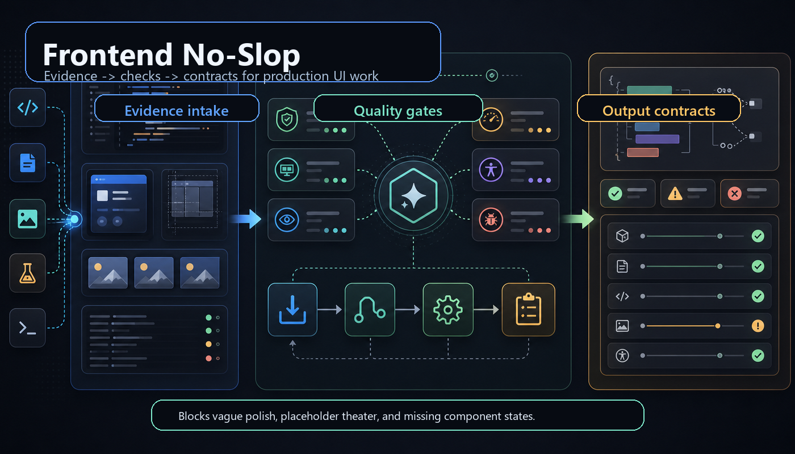
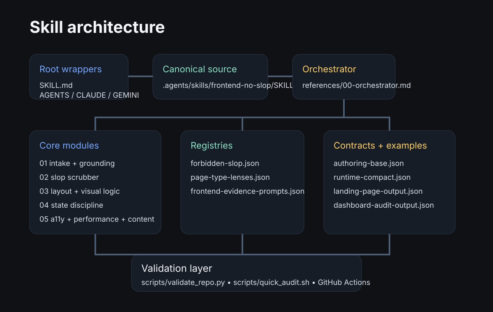

# Frontend No-Slop

[](LICENSE)
[](https://github.com/Emily2040/frontend-no-slop/actions/workflows/validate.yml)
[](AUDIT_REPORT.md)
[](.agents/skills/frontend-no-slop/SKILL.md)

Grounded frontend design and implementation guidance for agents that keeps UI work concrete, accessible, and production-aware instead of drifting into generic design filler.



## Quick Start

```bash
git clone https://github.com/Emily2040/frontend-no-slop.git
cd frontend-no-slop
python -m pip install -r requirements-dev.lock
python scripts/validate_repo.py
python scripts/sync_adapters.py --check
python scripts/check_docs.py
```

For local development without a lock file, install `requirements-dev.txt`. CI uses `requirements-dev.lock` for repeatable validation.

## Install Into Another Project

Copy the canonical skill plus the adapter for your agent:

```bash
cp -R .agents /path/to/project/
cp adapters/AGENTS.md /path/to/project/AGENTS.md
```

PowerShell:

```powershell
Copy-Item -Recurse -Force .agents C:\path\to\project\
Copy-Item -Force adapters\AGENTS.md C:\path\to\project\AGENTS.md
```

Use the matching adapter file for other clients:

| Client | Adapter to copy | Notes |
| --- | --- | --- |
| Codex / AGENTS-style loaders | `adapters/AGENTS.md` | Routes the agent to the canonical skill. |
| Claude Code | `adapters/CLAUDE.md` | Pair with the `.agents` directory or adapt to `.claude/skills/` if desired. |
| Gemini CLI | `adapters/GEMINI.md` | Keeps the same canonical skill path. |
| Cursor | `adapters/.cursorrules` | Lightweight project rule wrapper. |
| Cline | `adapters/.clinerules` | Lightweight project rule wrapper. |

This repo's root `AGENTS.md` is maintainer guidance for this repository. Do not copy it as the consumer adapter.

## What This Is For

Use this skill when an agent needs to:

- design or critique a landing page, dashboard, docs surface, settings page, onboarding flow, form, table, modal, app shell, or design-system primitive
- plan frontend implementation in React, Vue, Svelte, HTML/CSS, or stack-agnostic terms
- define design-system primitives, states, variants, and responsive behavior
- rewrite UI copy so it becomes literal and useful instead of generic marketing language
- audit a screen before deployment with structural, accessibility, performance, and packaging checks

## Non-Goals

Avoid this skill for:

- backend API design, data modeling, and infrastructure architecture
- database performance tuning and query optimization
- brand strategy or creative direction with no interface artifact
- legal or compliance interpretation that needs specialist review

## What It Blocks

This skill is opinionated against:

- aesthetic claims with no interface detail
- invented proof, fake metrics, and placeholder theater
- trend cargo-culting such as giant empty heroes, glass blur for no reason, or neon dashboards with no task logic
- component specs with missing states
- accessibility and performance hand-waving
- frontend advice that sounds nice but cannot be implemented

## Architecture



The package follows progressive disclosure and a canonical-source wrapper layout:

1. Root `SKILL.md` is a small router.
2. `.agents/skills/frontend-no-slop/SKILL.md` is the canonical skill entrypoint.
3. `references/00-orchestrator.md` loads focused core modules only when needed.
4. Registries store anti-slop rules, evidence prompts, and page-type lenses.
5. JSON schemas define machine-readable output contracts and eval manifests.
6. Validation scripts and CI keep adapters, schemas, examples, docs, and eval fixtures aligned.

## Repository Map

```text
.
├── .agents/skills/frontend-no-slop/
│   ├── SKILL.md
│   ├── references/00-orchestrator.md
│   ├── skills/core/
│   ├── registry/
│   ├── schemas/
│   ├── evals/
│   └── examples/
├── adapters/
├── SKILL.md
├── AGENTS.md
├── CLAUDE.md
├── GEMINI.md
├── .cursorrules
├── .clinerules
├── README.md
├── ROADMAP.md
├── AUDIT_REPORT.md
├── CHANGELOG.md
├── docs/
│   └── assets/hero-infographic.png
├── templates/
└── scripts/
```

## Key Files

- [Root router](SKILL.md)
- [Maintainer instructions](AGENTS.md)
- [Canonical skill](.agents/skills/frontend-no-slop/SKILL.md)
- [Consumer adapters](adapters/AGENTS.md)
- [Orchestrator](.agents/skills/frontend-no-slop/references/00-orchestrator.md)
- [Forbidden slop registry](.agents/skills/frontend-no-slop/registry/forbidden-slop.json)
- [Page-type lenses](.agents/skills/frontend-no-slop/registry/page-type-lenses.json)
- [Authoring schema](.agents/skills/frontend-no-slop/schemas/authoring-base.json)
- [Compact schema](.agents/skills/frontend-no-slop/schemas/runtime-compact.json)
- [Eval suite schema](.agents/skills/frontend-no-slop/schemas/eval-suite.json)
- [Eval cases](.agents/skills/frontend-no-slop/evals/frontend-no-slop-evals.json)
- [Validator](scripts/validate_repo.py)
- [Adapter sync](scripts/sync_adapters.py)
- [Hero infographic](docs/assets/hero-infographic.png)
- [Docs checker](scripts/check_docs.py)

## Validation

```bash
python -m pip install -r requirements-dev.lock
python scripts/validate_repo.py
python scripts/sync_adapters.py --check
python scripts/check_docs.py
```

The validator checks required files, skill frontmatter, root size, adapter routing and sync, placeholders, author identity, broken internal links, JSON schemas, examples, negative fixtures, page-type/schema alignment, eval fixtures, cache files, and docs assets.

## Release Checklist

1. Update `.agents/skills/frontend-no-slop/SKILL.md` `metadata.version`.
2. Add a dated entry to [CHANGELOG.md](CHANGELOG.md).
3. Run the validation commands above.
4. Tag the release with the same version string, for example `v2.0.0`.
5. Publish release notes that mention schema or adapter changes.

Breaking changes include schema/output-contract changes, adapter path changes, and canonical skill routing changes.

## Author

Created by **Iamemily2050**

- GitHub: [Emily2040](https://github.com/Emily2040)
- Website: [Iamemily2050.com](https://Iamemily2050.com)
- X: [@iamemily2050](https://x.com/iamemily2050)
- Instagram: [@iamemily2050](https://instagram.com/iamemily2050)

## License

MIT
